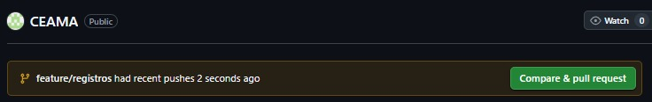
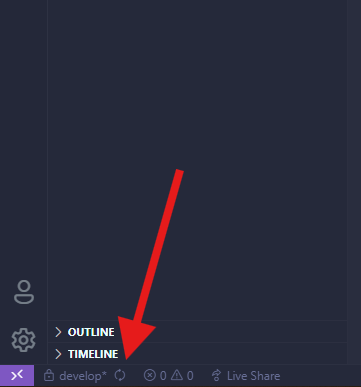

# CEAMA
## ⚙️ Requisitos previos
Antes de comenzar, asegúrate de tener instalado:

- [Python 3.10+](https://www.python.org/downloads/)
- [Git](https://git-scm.com/downloads)
- [Visual Studio Code](https://code.visualstudio.com/)

## Pasos para clonar y configurar el entorno

Sigue este procedimiento **exactamente en este orden**:

### 1. Clonar el repositorio

Abre la terminal "**CMD**" y pega esto:
```bash
git clone https://github.com/NevadoLG/CEAMA.git
```
Luego entra a la carpeta:
``` bash
cd CEAMA
```
## 2. Crea y activa el entorno
### Crea el entorno:
``` bash
python -m venv venv
```
### Activa el entorno:
``` bash
venv\Scripts\activate
```
### Si lo hicieron bien veran algo tipo:
``` bash
(venv) C:\Users\Usuario\CEAMA>
```
## 3. Crea tu rama de trabajo
### Dependiendo de lo que trabajen creará su propia rama
``` bash
git checkout -b feature/Lo-que-van-a-hacer
```
### Una vez hecho eso suben la rama al repositorio remoto con:
``` bash
git push origin feature/Lo-que-van-a-hacer
```
### Si no hay ningún problema GitHub mostrará algo como: 
### https://github.com/NevadoLG/CEAMA/pull/new/feature/Lo-que-van-a-hacer

### Habiendo hecho eso deben volver a la rama principal de desarrollo usando:
``` bash
git switch develop
```
### Y proceden a hacer una pull para actualizar los cambios
``` bash
git pull origin develop
```
### Cuando ya hicieron la pull vuelven a su rama que habian creado antes usando
``` bash
git switch feature/Lo-que-van-a-hacer
```
### Y pueden comenzar a hacer sus cambios o codificar y para que los lleve
### directo a la carpeta donde esta todo usan:
``` bash
code .
```
## 4. IMPORTANTE Y NECESARIO (Subir cambios)
### Cuando ustedes creen algo en el repositorio y quieran subirlo a GitHub para
### que todos los demás lo vean colocan: 
``` bash
git add .
git commit -m "Descripción corta del cambio realizado"
git push origin feature/La-rama-que-estan-usando
```
### Esto sirve para añadir los cambios que hicieron, pero esto aun no esta subido aún.
### Lo que tienen que hacer es cambiarse a la rama principal, en este caso para feature es
### develop y para ello usan: 
``` bash
git switch develop
```
### Una vez que se cambiaron, hacen la pull 
``` bash
git pull origin develop
```
### Habiendo hecho eso tienen que ir a su GitHub en la web y les aparecerá
### la siguiente imagen en la cual le tendrán que dar en compare & pull request
 
### y les aparecerá otra ventanita del commit que tambien deberán darle al boton verde.
### LLegados a ese punto notifican por el whatsApp a cualquiera del grupo para aceptar el cambio
### y le dan aprove y rebase para subir el cambio.

## 5. Aprobación de la pull
### Cuando alguien del grupo ya acepto la pull y quieren ver los cambios tienen
### que darle a reload, es decir, las dos flechitas al lado de develop:
 